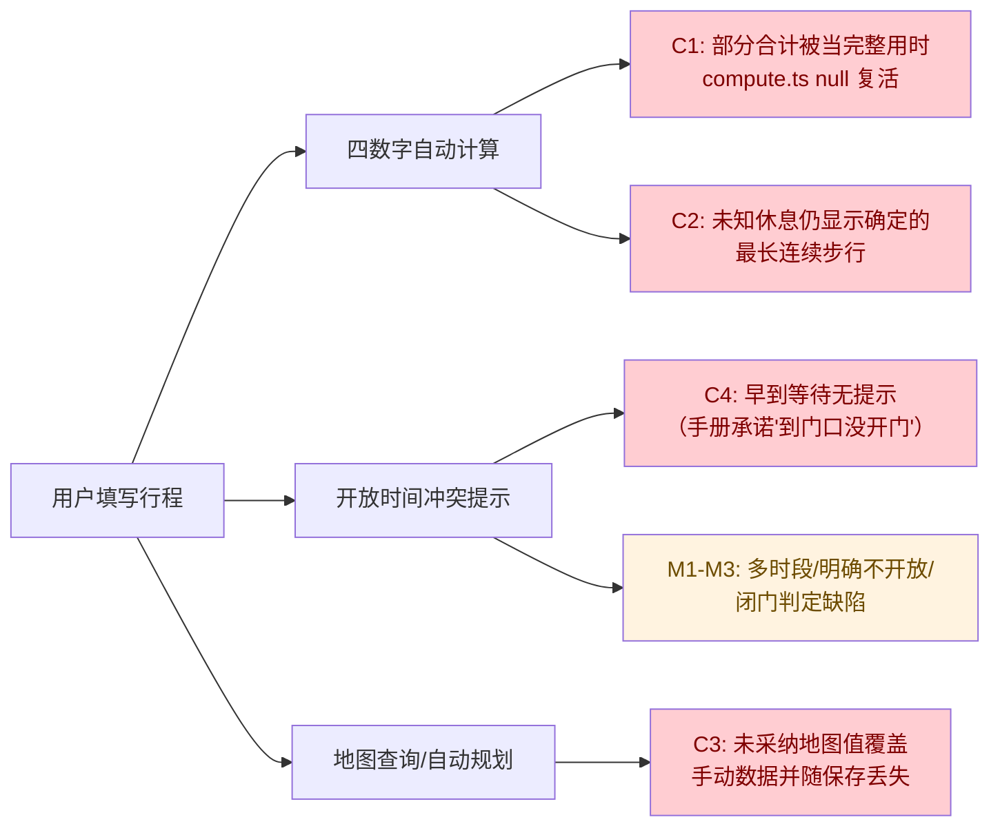
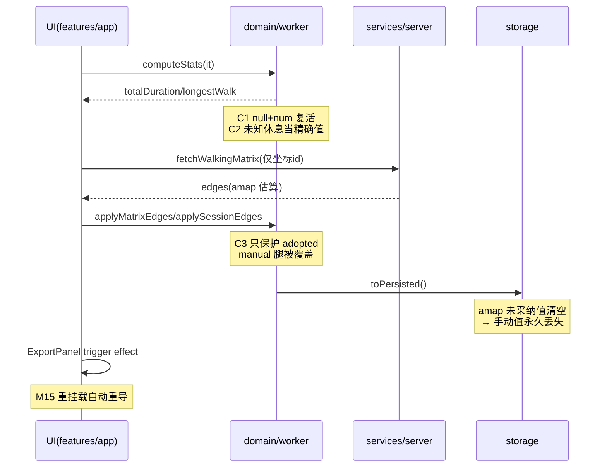

# 《省脚力路线卡》代码审查报告

**基线：《省脚力路线卡-用户使用说明书》（唯一依据）**
**范围：** `src/`、`server/`、`api/`、`shared/`、`scripts/`、配置与测试
**方法：** 三路逐文件审查 + 主审逐行复核 + 双子代理交叉验证（25–40 号问题 2/2 确认；1–24 号由主审亲读源码确认，个别单源项标注 ⚠）
**日期：** 2026-09-24

---

## 一、总体结论

- **技术选型**：与手册一致 —— `npm run dev`（5173）/ `npm run server:dev` / `.env` 高德 Web 服务 Key / 浏览器 localStorage / 离线可用均有落地；React 18 + TS strict + Vite + Fastify + Zod + html-to-image + Web Worker，无第二套方案混用。
- **功能实现**：手册约 26 组功能承诺绝大多数逐字落地（按钮文案、四数字、分张保存、文件名、二次确认、节庆窗口、备份往返、"仅当前会话有效/采纳才存"等，见文末"符合项"）。
- **主要问题**：共 **38 项**不符合项——**4 critical、16 major、18 minor**。集中在三条主线：
  1. "不瞎猜数字、缺就报待确认"的核心承诺被 3 处计算缺陷击穿；
  2. "开放时间帮你发现冲突"只做了一半（只有超闭门方向）；
  3. 地图估算会覆盖并吞掉用户手动数据。

  另有 5 处手册与实现互相不一致（多为文档措辞需修订）。

### 缺陷影响的业务流

### 关键技术链路与缺陷落点

---

## 二、严重（critical，4 项）——击穿手册"不瞎猜数字/不丢资料"承诺

| No. | 问题 | 修改建议 | 代码位置 |
|---|---|---|---|
| 1 | "预计全程用时"把部分合计当完整总数：`totalDuration! += x` 在置 null 后因 JS `null+num=num` 语义复活为正数，视图层按确定值展示 | 累加器改为"精确性布尔 + known 累加"两变量，`+=` 前判 null | `src/domain/compute.ts:202-206`、`src/features/route-card/buildViewModel.ts:114-122` |
| 2 | 违背手册 FAQ"休息点没填时长……只会说'待确认'"：未知休息按"可能分界"切段后 `longestContinuousWalkSeconds` 仍输出确定值 | 出现任何"可能分界"切分时置区间边界不确定，令精确值返回 null，只走"已知约"下界文案 | `src/domain/compute.ts:277-282`、`src/domain/compute.ts:313-314` |
| 3 | 地图估算静默覆盖并吞掉用户手动数据：`applyMatrixEdges/applySessionEdges` 只保护 `adopted`，`manual` 腿被覆盖（且强改 `mode:'walking'`、乘车接驳丢失接驳总时长）；因未采纳值不落盘，保存/备份后手动数据**永久丢失**（违反手册第 4 步主流程 + 第 7 章"点采纳才存"） | 两处跳过 `manual/adopted/same-entrance` 腿，不改写 `mode` 与接驳总时长（与 `adoptAllMapLegs` 保护口径对齐） | `src/domain/itinerary.ts:567-571`、`src/domain/planning.ts:90-95` |
| 4 | 手册第七章承诺"会帮你发现'到了门口人家还没开门'这种冲突"**未实现早到方向**：等待开门只把等待分钟静默加进全程用时，无任何提示（只有超闭门方向有 `closingConflicts`） | 等待开门产出对称的 `openWaits`（站名/到达时刻/等待分钟），经 status 通知与卡片 notice 展示 | `src/domain/compute.ts:231-237`、`src/domain/status.ts:74-78` |

---

## 三、重大（major，16 项）

| No. | 问题 | 修改建议 | 代码位置 |
|---|---|---|---|
| 5 | 多时段开放（如 `08:00-12:00,13:30-17:30`）午休空档到达 12:30 **不计等待**（只比 `Math.min(所有 start)`） | 按"覆盖到达时刻/其后下一窗口"判定等待 | `src/domain/compute.ts:229-237` |
| 6 | 当天**明确不开放**（契约定义 `windows=[]`）不触发任何提示，行程可判"完整" | `applicableWindows` 返回 `[]` 时产出"该日明确不开放"冲突并计入草稿态 | `src/domain/compute.ts:224-225` |
| 7 | 闭门判定三处缺陷：`visitSeconds ?? 0`（留空当 0）、只与首个窗口 end 比较、日秒回绕致跨零点漏报 | 按"离开时刻是否被窗口完整覆盖"判定，用 epoch 比较 | `src/domain/compute.ts:244-256` |
| 8 | "已核实坐休"口径偏离手册"确认过有座位的休息点有几次"：座位已确认但时长留空不计、短于最低休息被剔除、景点内坐休也算"休息点次数" | 计数改为"座位已确认的独立休息点"，与连续步行分界资格解耦 | `src/domain/compute.ts:61-74` |
| 9 | `classifyRest` 不看 `reviewState`：备份导入的 `reported` 座位可被当"已核实"（凭空 +1 坐休、缩短连续步行） | 仅 `userChecked` 的 `value:true` 计 hardRest，`reported` 归 possibleRest | `src/domain/compute.ts:61-65` |
| 10 | 同一休息的分类规则分裂：园内活动传 `minRestSeconds=null`、独立休息点传约束值，分界/计数随位置漂移（planner 同病） | 两处统一传 `constraints.minRestSeconds` | `src/domain/compute.ts:81`、`src/domain/compute.ts:302` |
| 11 | 契约不校验日期/时间格式 + `?? 0`/NaN 兜底 → 非法输入可得**假 PASS 或假 FAIL** | `travelDate`/`departureLocalTime`/`latestEndLocal` 加正则；解析失败一律 UNKNOWN，禁 `?? 0` | `shared/contracts/domain.ts:255-260`、`src/domain/compute.ts:364-370` |
| 12 | "乘车接驳"只填步行未填接驳全程（ready+`totalTravelSeconds:null`）不登记缺失项 → 可判"完整"但用时待确认（违反"该填的都填了才算完整"） | `legTotal===null` 一律登记缺失（标签区分"接驳全程待补充"） | `src/domain/compute.ts:201-215` |
| 13 ⚠ | 待确认事实统计不覆盖 `restNode.seatFact`/`visitActivity.seatFact`，未核对座位不阻止"完整" | `countUnverifiedFacts` 补遍历各 Fact 槽位 | `src/domain/status.ts:88-101` |
| 14 ⚠ | `request()` 不检查 `res.ok`、不校验响应形状，坏响应体被当成功返回 `undefined`（假空结果） | 校验 `res.ok` 与 `ApiSuccess` 形状，否则抛 `UPSTREAM_DATA_INVALID` | `src/services/api.ts:26-36` |
| 15 ⚠ | `scanItineraryRecords` 枚举异常返回空表 → `rebuildIndex` 把索引**写空**（违背自身"绝不静默清空"承诺） | 枚举失败返回失败信号，拒绝写索引并如实报错 | `src/storage/local.ts:284-291`、`src/storage/local.ts:511-517` |
| 16 | `rebuildLegs` 同身份腿不去重：同一入口反复切换可累积重复腿，取值靠 `Object.values().find` 键序运气 | 以 `legKey` 去重（优先级 same-entrance>adopted>manual），kept 循环跳过同 key 旧腿 | `src/domain/itinerary.ts:373-413`、`src/domain/itinerary.ts:458-476` |
| 17 | timeline 活动 `kind:'other'` 被当步行计入"预计总步行/最长连续步行"（compute 与 planner 两处） | 仅 `kind==='walk'` 进步行统计 | `src/domain/compute.ts:79-87` |
| 18 ⚠ | 规划模拟不检测闭门时间，可产出到点已关门的"主要建议"且不记违规 | `simulate` 复用闭门判定，冲突记入 violations 或降排名 | `src/workers/planner.ts:308-349` |
| 19 | 导出面板 `useEffect([trigger])` **挂载即执行**：窄屏切回预览重挂载时用陈旧 trigger 自动重导（白耗 CPU/内存，还误触发庆祝烟花） | 用 ref 记录已消费 trigger 值，仅严格递增时启动 | `src/features/export/ExportPanel.tsx:51-55` |
| 20 | **文档与实现不一致**：手册"每填完一格按一下回车键，内容才会保存"，实际失焦即存、日期/时间 onChange 即存 | 保持自动保存，改手册为"输入后自动保存在本机"（更符合现行为、不丢数据） | `src/components/fields.tsx:58-61`、`src/features/itinerary/TripEditor.tsx:242-251` |
| 21 | 手册示例 Node `v20.11.0` 下 `.env` **静默失效**（`process.loadEnvFile` 需 ≥20.12）：配好 Key 仍恒显示"地图服务未配置" | 加无依赖 .env 解析回退（verify-amap.mjs 已有实现可复用）＋ `package.json` 声明 `engines` | `server/env.ts:25-30` |
| 22 | 矩阵预算按"每请求"创建（注释却称单实例/总速率）：N 并发 = N 份预算，易触发高德限流拖垮联网功能 | 速率桶+并发信号量提升为进程级共享，修正注释 | `server/api-core.ts:240-248`、`server/amap/budget.ts:14-18` |
| 23 | Pages 路径 `request.text()` 无上限整读（64KiB 判限在全量缓冲后），且全局无 IP/日配额限流 → 部署后等于持 Key 开放代理 | 按 Content-Length 预拒/流式计数；加每 IP 限流与单日上游上限 | `api/routes/walking-matrix.ts:10-14`、`server/api-core.ts:360-368` |
| 24 | **文档与实现不一致**：手册"只有搜地点/自动查步行时间/自动规划需要联网"，实际**附近设施检索、歇脚绕行对比**也需联网 | 手册补进联网功能清单（实现侧降级文案已合格） | `src/features/facilities/FacilityDialog.tsx:475-480` |

---

## 四、一般（minor，18 项）

| No. | 问题 | 修改建议 | 代码位置 |
|---|---|---|---|
| 25 | `facts` 用 `z.unknown()` 不校验 Fact 形状，3 处 `as` 断言；坏数据可使"导出备份"抛错中止 | 定义 `factSchema` 收紧契约 | `shared/contracts/domain.ts:185-189` |
| 26 | `stale` 口径矛盾：统计把 stale 时长计入合计，编辑区却视为"待补充" | 统一"stale 不计入精确合计"语义 | `src/domain/compute.ts:200-201` |
| 27 | 规划候选含未知 id 时静默过滤/拼接；`MatrixEdgeValue` 不带坐标版本校验（applyMatrixEdges 有） | 未知 id 报"行程已变化"；边值带 `coordinateRevision` 写前比对 | `src/domain/planning.ts:58-64` |
| 28 | `setManualLegTime` 静默拒绝（`return it`）；`restoreLegToMapValue` 名实不符（实为清空回 missing 且标 manual） | 返回拒绝信号；更名 `clearLegToMissing` | `src/domain/itinerary.ts:518-521`、`src/domain/itinerary.ts:664-679` |
| 29 | 导出快照只冻结画面，文件名取"保存那一刻"的实时行程名/日期 → 图与文件名可不一致 | `start()` 内一并冻结 `fileBaseName` | `src/app/App.tsx:154-157` |
| 30 | 按钮文案与手册不一致：窄屏「无法导出（请先完善行程）」（手册/桌面端为「无法导出」）、「🎑 节庆动画开」带 emoji 前缀 | 文案与手册一字不差，emoji 移到装饰位 | `src/app/App.tsx:320-324`、`src/app/App.tsx:268-271` |
| 31 | 节庆"烟花"不会自动出现（`fireworks` 是死字段，只在导出成功后绽放）＋ HiDPI 烟花坐标双重缩放 ＋ reduce-motion 粒子泄漏 | 按 `features.fireworks` 偶发自动绽放；传 CSS 像素宽高；reduce-motion 不生成粒子 | `src/features/festival/festival.ts:49-53`、`src/features/festival/FestivalOverlay.tsx:306-338` |
| 32 | 危险操作确认按钮 `autoFocus`，弹出后误按回车即删除/清空/覆盖（与手册"看清楚再点确认"不符） | danger 场景默认聚焦「取消」 | `src/components/ConfirmDialog.tsx:32-40` |
| 33 | 超高"原子块"直接报错"请精简后重试"，与手册"内容多长就切几张"字面不符（属有意兜底）；`blockId` 未用于提示定位 | 文案指名过长块；或 node 块支持行级续排 | `src/features/export/paginate.ts:144-150` |
| 34 | 状态更新器内做副作用（StrictMode 双写持久化）；`useSnapshotRef`/`MinutesField` 死代码且注释误导 | updater 保持纯函数，useEffect 统一 persist；删死代码 | `src/app/useItinerary.ts:83-92` |
| 35 | 卡片块 id 模块级自增 → 每次编辑整卡 DOM 卸载重挂（渲染性能） | 块 id 改为内容稳定键（`node-${id}` 等） | `src/features/route-card/buildViewModel.ts:22-26` |
| 36 | 隐私披露缺口：附近检索/矩阵外发坐标，手册只写"发关键词和城市"；`requestId` 塞进 RequestInit 被 fetch 忽略（死参数） | 手册补一句坐标外发；requestId 真发或删除 | `src/services/api.ts:26-30` |
| 37 | 细节打包：只有批量「采纳全部地图估算」无逐段采纳；空结果文案"附近没有找到候选"与"没查到≠没有"措辞不一；标签切回编辑不走 `goEdit` 堆积历史；页脚固定样本测量；dataURL 经 fetch 转 Blob 内存峰值 | 补单段采纳或改手册措辞；统一"没查到"；标签走 goEdit；按真实页脚测量；改 `toBlob` | `src/features/itinerary/TripEditor.tsx:320-324`、`src/features/facilities/FacilityDialog.tsx:500-506` |
| 38 | 服务端错误契约/校验细节打包：4xx 透传 `error.message`、`logger:false` 零日志、上游 `info` 原文直达用户、`Number()` 宽松数字解析、requestId 双标、`placeId` 无上限、`TypeError` 一律报"上游超时"且 502/503 不重试、`retryable` 恒 false 与测试桩相反、`round6`/`fnv1a`/时间换算重复实现（注释称已统一实则有差异） | 收敛错误文案为中文白名单＋诊断字段；补最小结构化日志；收紧入参；统一重复实现 | `server/index.ts:43-50`、`server/amap/client.ts:94-98`、`server/amap/errors.ts:14-26` |
| 39 | 配置/测试打包：vite 未 `strictPort`（5173 被占会跳 5174，与手册写死网址冲突）；playwright 注释虚报 WebKit；tsconfig types 缺 node；verify-amap 核验失败仍 exit 0、Key 不剥引号；**测试缺口**：导出快照冻结、图片文件名格式、3 倍密度、外发请求不含备注/姓名/标题、删除站点与跳过必去的二次确认、回车触发保存、节庆不进导出图/reduce-motion、响应与日志不含 Key（现仅默认跳过的 live 用例有） | `strictPort:true`；修正注释；脚本失败退出 1；按缺口补断言 | `vite.config.ts:5-9`、`playwright.config.ts:5-8`、`scripts/verify-amap.mjs:20-24` |
| 40 | Worker/杂项打包：worker 不校验 `message.type`、回传 `inputFingerprint` 不比对、全量候选随 postMessage 回传（约 2000 条）；`titleIgnored` 死字段、32 位 FNV 承担版本校验偏弱；`travelDateText` 恒等透传；domain barrel 不全；Dialog 用含标点标题拼 DOM id | 校验消息类型与指纹；只回传 top-N；双哈希或原串比对；清理死代码 | `src/workers/planner.worker.ts:19-36`、`src/domain/fingerprint.ts:10-14` |

---

## 五、技术选型 / 性能 / 开发规范 专项结论

- **技术栈一致性：通过**。Node.js + Vite(5173) + Fastify(8787，`/api` 代理) + 高德 Web 服务 Key 仅服务端读取、`.env.example` 只含占位、日志与错误正文未见 Key/`key=`；React 18 + TS `strict:true` + CSS Modules + Radix 单对话框原语 + html-to-image + Web Worker 分包，未混用第二套方案。
- **性能指标**：手册承诺基本满足——导出 3 倍像素密度、360px 纸面、960px 分页、文本按行拆分不裁切不缩字号、逐页渲染释放对象 URL/画布均落地；风险点为 #19 重复导出、#35 整卡重挂、#37 内存峰值、#40 全量候选序列化、#22 预算失效导致联网体验劣化。
- **错误处理**：降级链路合格（未配置 Key 三处提示、手动功能不受影响、失败可重试、保存失败不做假"已保存"）；薄弱点为 #14 假成功、#15 静默清索引、#28 静默拒绝、#38 错误文案/日志。
- **命名与注释**：整体中文注释与手册口径对应良好；问题集中在误导性注释/名实不符（#28、#34、#38、#40）与死代码。
- **测试**：服务端测试确用伪造 fetch 不联网（合规）；手册承诺的 9 类行为无断言锁定（#39 清单）。

---

## 六、符合项（抽查确认）

四数字标签逐字一致与"已知约 X 分钟"下界文案、留空≠0、跳站/调序/改坐标后路段作废（`legKey` 含坐标版本六元组）、跳过可恢复、逐属性确认+"没查到≠没有"、直线距离仅标注、"同一入口"判定严格（同 place 且入口已确认）、未采纳不落盘/备份不带、备份导入三段校验且失败保持现行程、导出快照冻结（画面）、文件名格式、逐张"保存第 N 张"、节庆 9/20–10/7 窗口/开关/reduce-motion/不进导出图/不挡交互、破坏性操作二次确认（含必去跳过多问一句）、离线手动全链路可用。

---

## 七、测试覆盖缺口清单（手册承诺但无断言锁定）

1. 导出点击时快照冻结（`ExportPanel.tsx:58-60`）
2. 图片文件名"行程名称-日期-第N张.png"（`App.tsx:156` + `ExportPanel.tsx:101`）
3. 导出 3 倍像素密度 / 1080px 输出宽（`paginate.ts:16`、`render.tsx`）
4. 外发请求不含地点备注/姓名/行程标题（`services/api.ts`、`usePlanning.ts`）
5. 删除站点二次确认（`TripEditor.tsx`）
6. 跳过必去景点二次确认（`TripEditor.tsx`）
7. 回车触发保存（`fields.tsx`）
8. 节庆动画不进导出图 + reduce-motion 静默（`FestivalOverlay.tsx`、`render.tsx`）
9. 响应/日志不含 Key 或 `key=` 的常规回归断言（现仅默认跳过的 `tests/integration/amap-live.test.ts:59` 有）

---

⚠ = 交叉验证中仅单源确认（另一验证组超时），经主审读码复核成立，置信度中等偏上，建议修复时顺手再核一眼。
