# 省脚力路线卡 · 用户使用说明书

> 这份说明书是写给"完全不懂软件"的人的。你只要认字、会打字，按着从上往下做，就能做出一张能发给家人的大字路线卡。
> 每一步该点哪里、该填什么，都写清楚了；看不懂就照着截图找长得一样的按钮。
> 文中所有截图和动图都可以点击放大。

---

## 目录

1. [这是什么软件](#一这是什么软件)
2. [怎么打开软件](#二怎么打开软件)
3. [认识界面（先看懂三个区域）](#三认识界面先看懂三个区域)
4. [主教程：5 分钟做一张路线卡](#四主教程5-分钟做一张路线卡)
5. [手机 / 平板上怎么用](#五手机--平板上怎么用)
6. [同时做几份行程（行程管理）](#六同时做几份行程行程管理)
7. [更多玩法（可以先跳过）](#七更多玩法可以先跳过)
8. [名词解释（看数字前先看这里）](#八名词解释看数字前先看这里)
9. [常见问题（出事先看这里）](#九常见问题出事先看这里)
10. [三句要紧的话](#十三句要紧的话)

---

## 一、这是什么软件

**省脚力路线卡**帮你把"要去哪几个地方"整理成一张**大字版路线卡**：

- 上面写着先去哪、后去哪、每段走多久、哪里能坐下歇脚；
- 字很大，家里的老人也看得清；
- 一键导出成**图片**，直接发到家庭群、打印出来带着走。

你**不需要注册账号**、**不需要联网也能用**（手动填写、看卡、导出图片都不用网）。所有行程只存在你自己的电脑 / 手机浏览器里，不上传。

---

## 二、怎么打开软件

### 第 1 步：装 Node.js

先在电脑上安装 **Node.js**（一个免费的运行工具）。打开网站 <https://nodejs.org/zh-cn>，点那个绿色的大按钮下载，一路点"下一步"装完即可。

> 小白提示：怎么确认装好了？按键盘 `Win + R`，输入 `cmd` 回车，弹出的黑窗口里敲 `node -v` 回车。如果显示出类似 `v20.11.0` 的字样，就是装好了。

### 第 2 步：安装本软件的依赖

按 `Win + R`，输入 `cmd` 回车，先敲下面这行（进入软件文件夹）：

```bash
cd c:\Users\qindi\Desktop\EasyWalk
```

再敲：

```bash
npm install
```

> 这一步只需要第一次使用时做，会下载一些文件，等它自己跑完（黑窗口不再滚动）就行。

### 第 3 步：启动软件

在同一个黑窗口里敲：

```bash
npm run dev
```

等它显示出 `Local: http://localhost:5173/` 字样后，**保持这个黑窗口开着不要关**，打开浏览器（Edge / Chrome 都行），在地址栏输入：

```text
http://localhost:5173
```

回车，看到下面这个界面就是成功了：

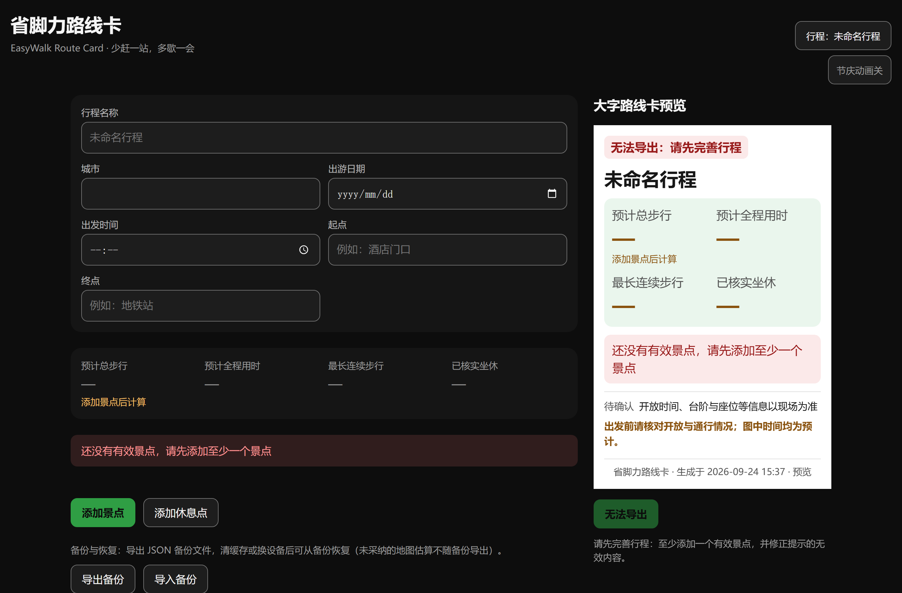

> 以后每次用软件：只需重复第 3 步（敲 `npm run dev`，浏览器打开网址）。用完把黑窗口关掉即可，**行程不会丢**。

### 可选：开通"地图查询"功能（不做也不影响主流程）

上面这样启动后，**手动填行程、看卡、导出图片全部正常**。只有"搜地点""自动查步行时间""自动规划"这三个高级功能需要联网的地图服务：

1. 把 `.env.example` 复制一份，改名为 `.env`；
2. 在里面填入高德**Web 服务**Key（去高德开放平台免费申请）；
3. 再开一个黑窗口，同样进入软件文件夹，敲 `npm run server:dev`。

不配置也没关系，说明书第四章教的就是不用地图服务的纯手动做法。

---

## 三、认识界面（先看懂三个区域）

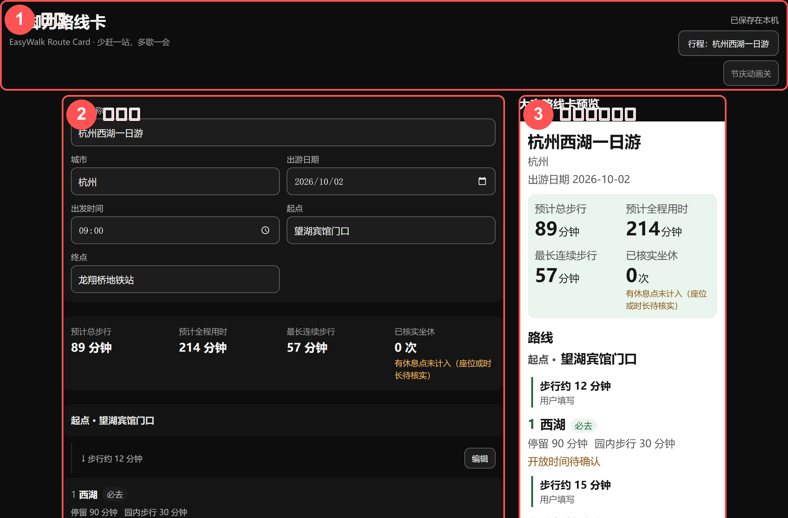

| 编号 | 区域 | 是干什么的 |
| --- | --- | --- |
| 1 | **顶栏**（最上面一条） | 显示行程名字、"已保存在本机"提示；点"行程：xxx"能管理多份行程；右边还能开关节庆动画 |
| 2 | **编辑区**（左边大块） | 你填东西的地方：基本信息、景点列表、步行时间、汇总数字 |
| 3 | **预览与导出区**（右边窄条） | 实时显示给家人看的大字路线卡，底下就是"导出图片"按钮 |

> 手机 / 平板上没有"左右两栏"，而是用底部按钮来回切换，见[第五章](#五手机--平板上怎么用)。

---

## 四、主教程：5 分钟做一张路线卡

跟着做一遍。示例行程：**杭州西湖一日游**。

### 第 1 步：填基本信息

在左上角的表单里，把 6 个格子填了：

| 格子 | 填什么 | 示例 |
| --- | --- | --- |
| 行程名称 | 随便起个名字 | 杭州西湖一日游 |
| 城市 | 去哪个城市 | 杭州 |
| 出游日期 | 点格子会弹出日历 | 2026/10/02 |
| 出发时间 | 几点出门 | 09:00 |
| 起点 | 从哪里出发 | 望湖宾馆门口 |
| 终点 | 最后到哪里 | 龙翔桥地铁站 |

填完长这样（**每填完一格按一下回车键**，内容才会保存）：

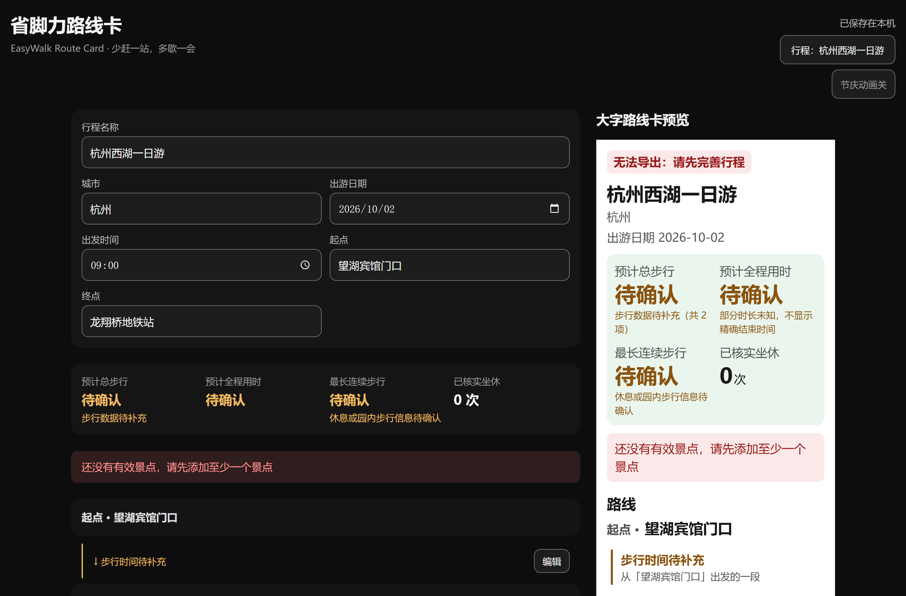

> 起点、终点不填也行，但填了路线卡更完整。日期和时间不填就是"未定"，随时能补。

### 第 2 步：添加景点

1. 滑到编辑区最下面，点蓝色按钮 **「添加景点」**；
2. 弹出的窗口里填：
   - **名称**：景点名字，例如"西湖"；
   - **是否必去**：选"必去"（一定要去）或"可选"（累了可以跳过）；
   - **预计停留（分钟）**：打算玩多久，例如 90；不知道就留空；
   - **园内预计步行（分钟）**：在景点里面还要走多久，例如 30；
3. 点 **「添加」**。

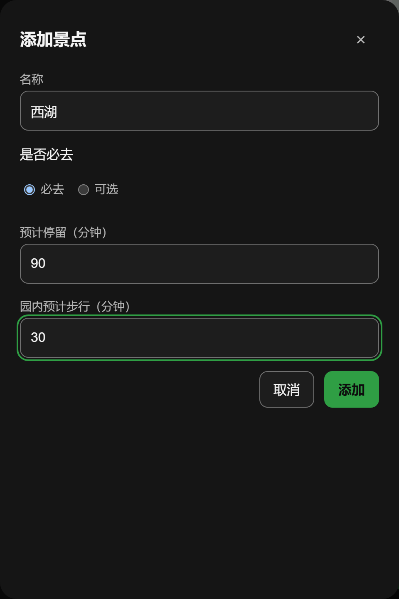

看一遍完整动作（动图）：

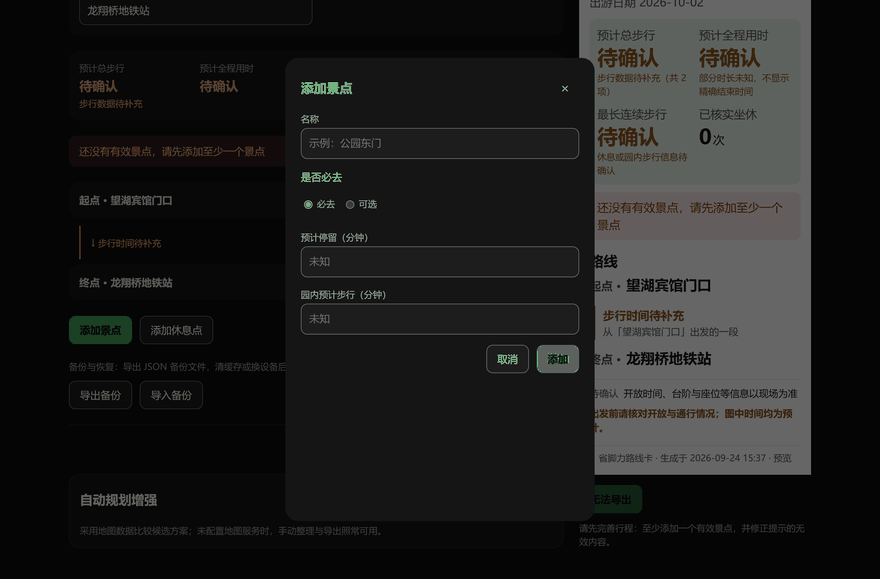

照这个方法把要去的地方一个个加进去（示例加了"西湖""河坊街"）。

> 小白提示：数字拿不准就**留空**。留空不等于 0，软件会标成"待确认"，不会瞎猜、也不会算错。

### 第 3 步：添加休息点

走累了要坐的地方也加进去，方法几乎一样：

1. 点 **「添加休息点」**；
2. 填名称（例如"湖滨长椅歇脚"）和**计划休息（分钟）**（例如 15）；
3. 点 **「添加」**。

休息点会出现在路线中间，卡片上带一个"休息点"小标签。

### 第 4 步：填写每段步行时间

每两个站点之间有一条写着"↓ 步行时间待补充"的横条，这就是**路段**。把每段走多久填上：

1. 在横条右边点 **「编辑」**；
2. 在"其中步行（分钟）"里填数字，例如 12；
3. 点 **「确认修改」**。

弹窗里还能选"乘车接驳"，那是坐车+走路混合的路段，多填一个"接驳全程"即可。

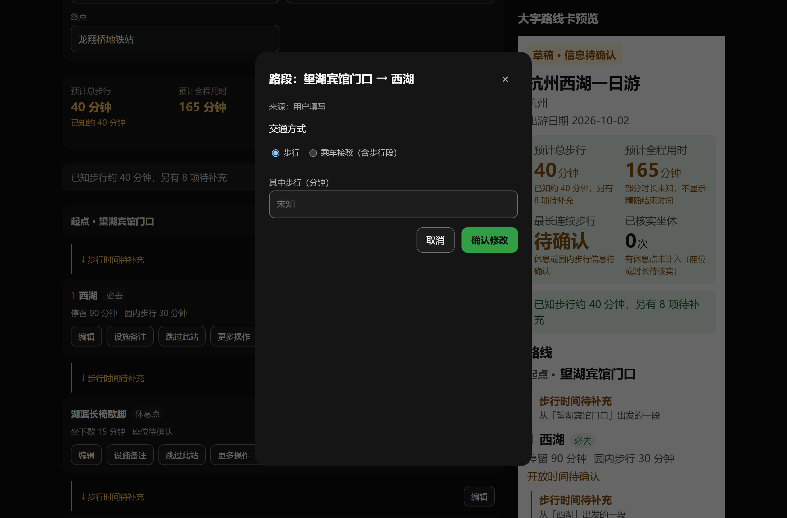

看一遍完整动作（动图）：

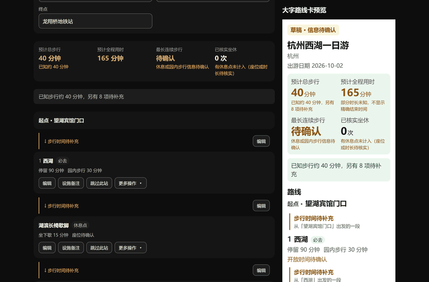

全部填完，整份行程看起来是这样的：

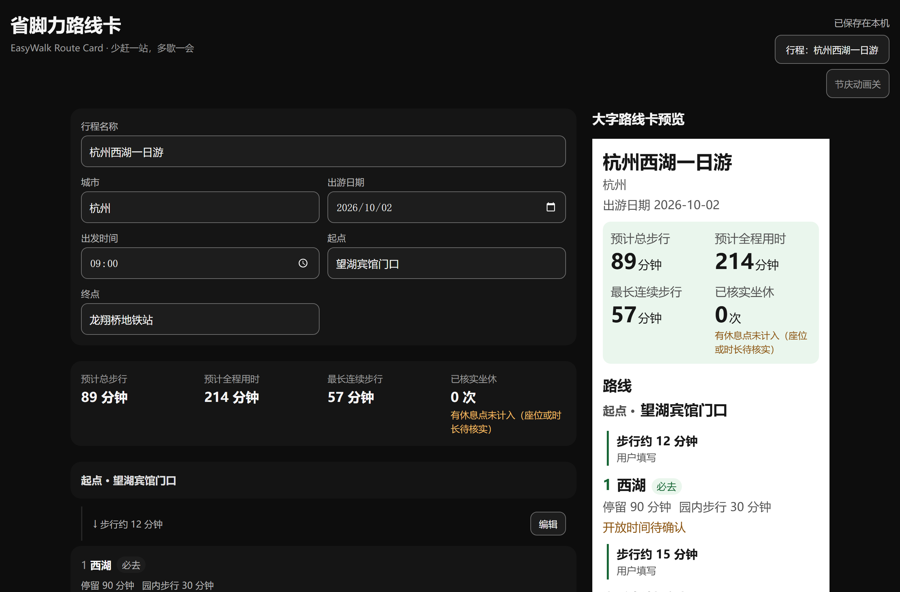

> 注意：如果以后你**跳过某一站、调换顺序、改了地点**，相关路段的时间会作废重新标成"待补充"——因为路变了，旧时间不能乱用。这是特意设计的，不是坏了。

### 第 5 步：看懂四个大数字

编辑区中间那排数字是**自动算出来**的，不用你管：

| 数字 | 意思 | 示例 |
| --- | --- | --- |
| 预计总步行 | 一天总共要走多少分钟 | 89 分钟 |
| 预计全程用时 | 走路＋游玩＋休息，一共花多久 | 214 分钟 |
| 最长连续步行 | 中间不歇气，最长的一段走多久 | 57 分钟 |
| 已核实坐休 | 确认过有座位的休息点有几次 | 0 次 |

> 看到 **"待确认"** 或 **"已知约 X 分钟"** 别慌：这是软件在老实告诉你"还有信息没填，目前只知道这些"。它宁可少说，也不瞎编数字骗你。

### 第 6 步：预览大字路线卡

右边（手机上是点底部"预览路线卡"）实时显示给家人看的卡片：字大、只写要紧的话。


### 第 7 步：导出图片并保存

1. 点绿色按钮 **「导出图片」**（如果还有信息没填全，按钮会叫 **「导出草稿」**；行程不完整时按钮是灰的 **「无法导出」**，把提示的缺项补上就好）；
2. 等它转一会儿，出现"图片已生成，共 X 张"；
3. 一张卡太长会分成几张图。点每个 **「保存第 N 张」**，图片就下载到你的电脑/手机了。

看一遍完整动作（动图）：

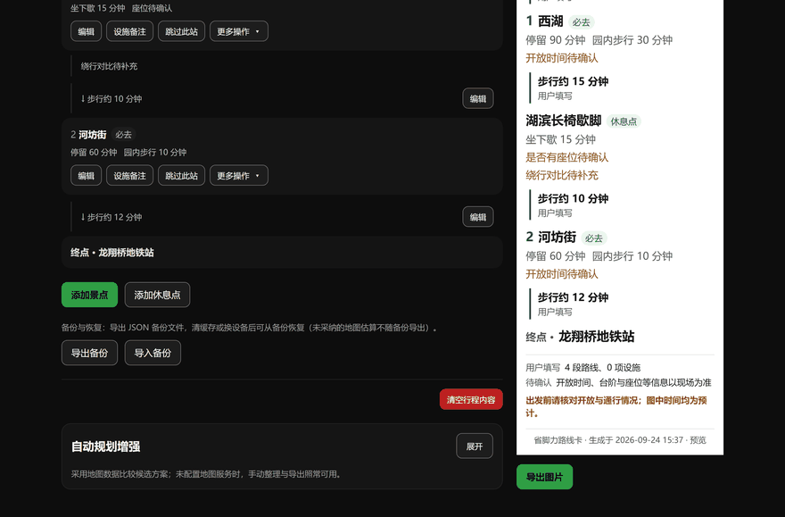

生成完的样子：

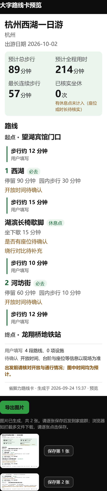

> 小白提示：
> - 浏览器如果问"是否允许下载多个文件"，点**允许**；不允许就一张一张点保存。
> - 点"导出"那一刻的画面被固定下来了，导出过程中你再改动行程，**不影响**这一次导出的结果。
> - 卡片上写的"草稿"字样表示还有待确认信息，不是坏了。

### 第 8 步：发给家人

到手机相册 / 电脑的"下载"文件夹里找到图片（文件名是"行程名称-日期-第N张.png"），微信发到家庭群，齐活。

---

## 五、手机 / 平板上怎么用

手机上打开同一个网址，界面变成上下两块，用**底部大按钮**切换：

| 你看到的按钮 | 点了会怎样 |
| --- | --- |
| 底部「预览路线卡」 | 从编辑切换到大字卡预览 |
| 顶部「编辑行程」/「大字预览」标签 | 两个页面来回切 |
| 预览页底部「导出图片」/「导出草稿」 | 直接生成并保存图片 |
| 预览页里的「返回编辑」 | 回去继续改（手机的返回键也能回去） |

编辑页：

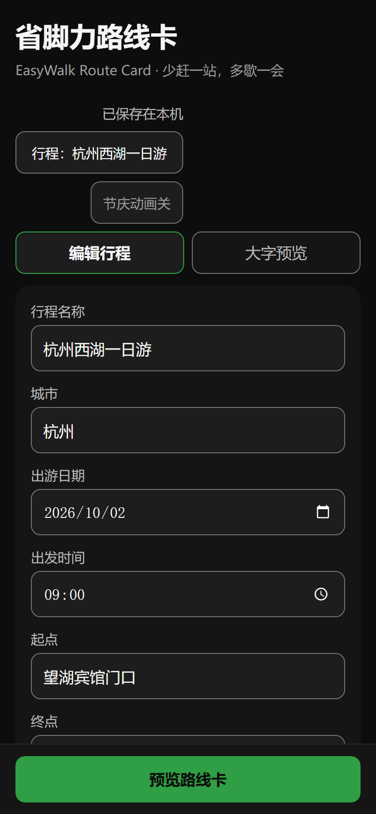

预览页：

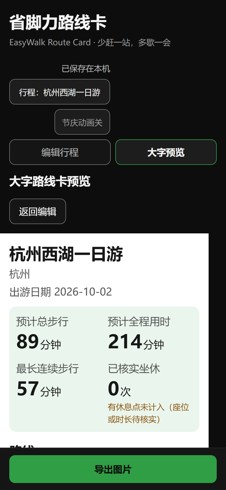

来回切换（动图）：

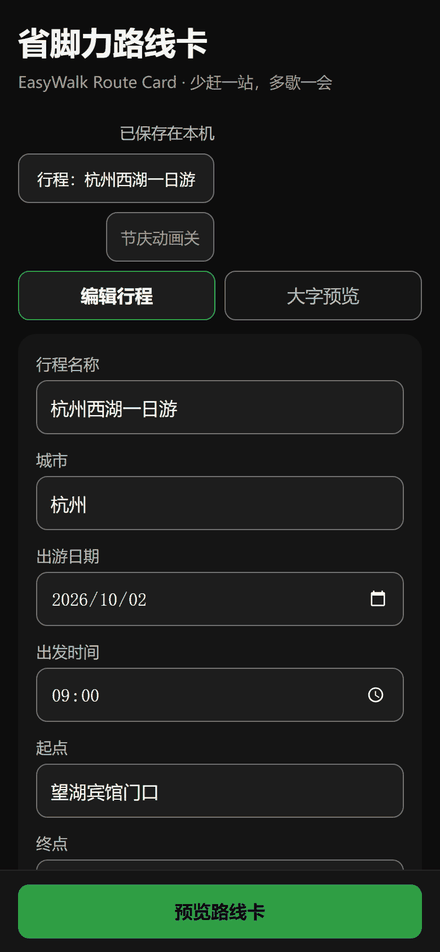

---

## 六、同时做几份行程（行程管理）

点顶栏右边的 **「行程：xxx」** 按钮，打开**行程列表**：

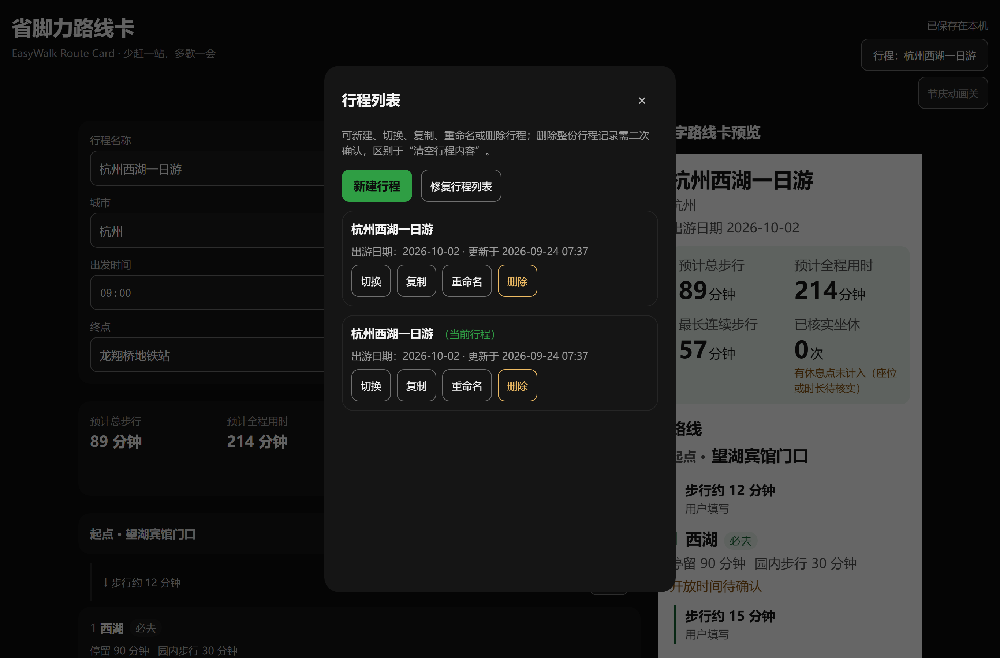

| 按钮 | 干什么 |
| --- | --- |
| 新建行程 | 开一份空白行程 |
| 切换 | 打开另一份行程接着编辑 |
| 复制 | 把这份行程原样拷一份（改日期做"下一次出行"很方便） |
| 重命名 | 改行程名字 |
| 删除 | 删掉**整份行程记录**（会再问你一次，删了找不回） |

> 千万别搞混：
> - 行程列表里的 **「删除」** = 把整份行程记录删掉；
> - 编辑区最下面的 **「清空行程内容」** = 只清空当前这份的内容（记录还在）。
> 两个都要二次确认。拿不准就先"导出备份"再动手。

---

## 七、更多玩法（可以先跳过）

### 1. 给景点补充详情

点景点卡片上的 **「编辑」**，可以改停留时间、记备注、填**开放时间**、核对入口。开放时间填了，软件会帮你发现"到了门口人家还没开门"这种冲突。

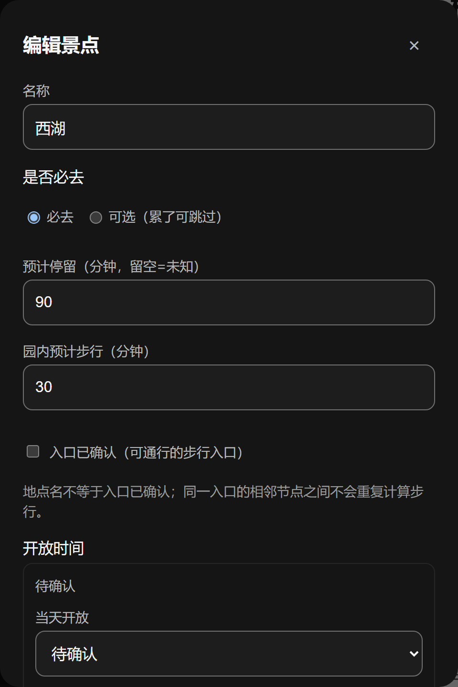

### 2. 记录厕所和歇脚点（设施备注）

点卡片上的 **「设施备注」**，可以记"附近哪有厕所""哪有椅子能坐"。每条信息都要**你自己确认过**才会写进去；软件搜不到的，只写"没查到"，**不会**写成"没有"。

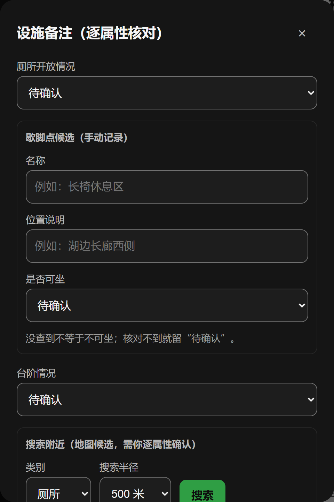

### 3. 调整顺序、跳过和删除

每张站点卡片上：

| 按钮 | 干什么 | 会不会丢资料 |
| --- | --- | --- |
| 跳过此站 | 这站不去了，先留着 | 不丢，卡片下方"已跳过"里能**恢复** |
| 更多操作 → 上移 / 下移 | 调整先后顺序 | 不丢 |
| 更多操作 → 删除 | 彻底删掉这个站点 | **丢了找不回**，会先问你一次 |

### 4. 自动规划（需要地图服务）

编辑区下方"自动规划增强"点 **「展开」**：

- **搜索地点**：输关键词（如"西湖"）和城市，点"搜索地点"，出来的候选可以一键"设为景点 / 设为起点 / 设为终点"；
- **规划条件与自动规划**：填"总步行上限""连续步行上限""最晚结束时间"等条件，让软件帮你排先后顺序、给"主要建议"和"备选"。


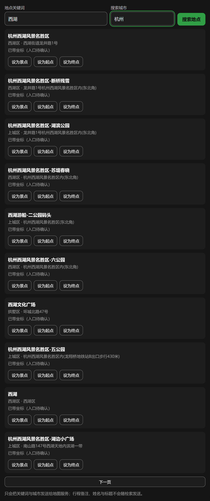

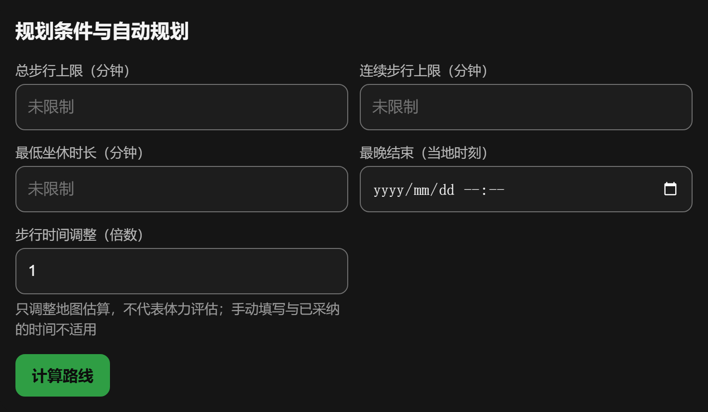

> 三条老实话：
> - 搜索时，你输的关键词和城市会发给地图服务（地点备注、姓名、行程标题**不会**发出去）；
> - 地图查回来的步行时间只是**估算**，会标"仅当前会话有效"，你点过"采纳"才会存下来；
> - 如果显示"地图服务未配置"，说明管理员还没配高德 Key，**手动填写完全不受影响**。

### 5. 备份与恢复（换电脑、清缓存前必做）

编辑区底部：

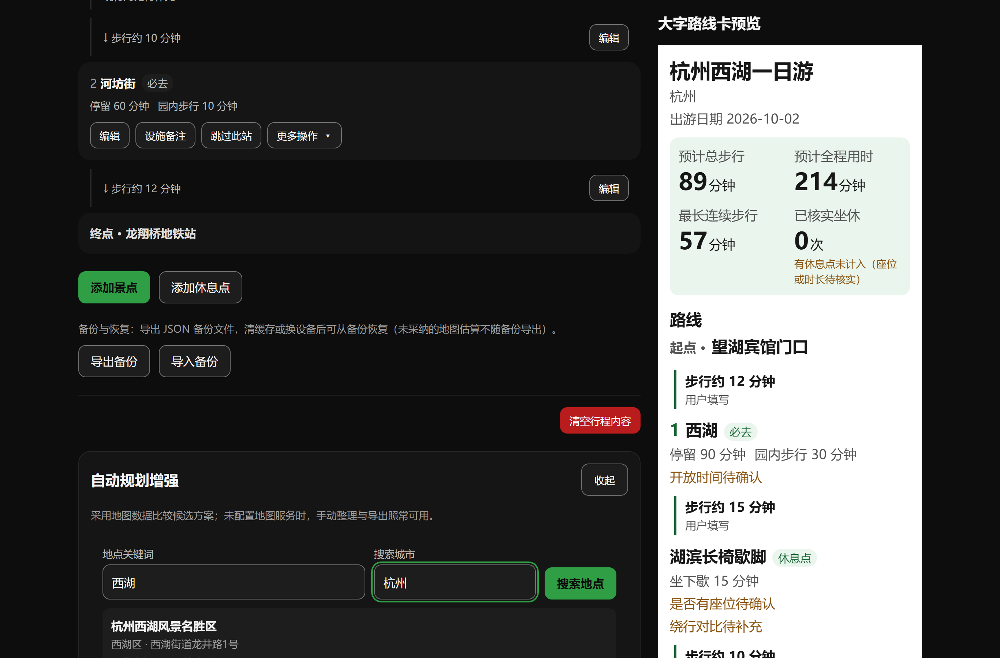

- **「导出备份」**：下载一个小文件（.json），存到网盘/U盘；
- **「导入备份」**：选中之前存的文件就能恢复（会覆盖当前行程，先问你一次）；
- **「清空行程内容」**：清空当前行程（红色按钮，要二次确认，建议先导图片留存）。

### 6. 节庆动画（应景的小彩蛋）

中秋国庆期间（9 月 20 日～10 月 7 日）打开软件，界面会自动出现月亮、烟花等小动画，**不影响操作、也不会出现在导出的图片里**：

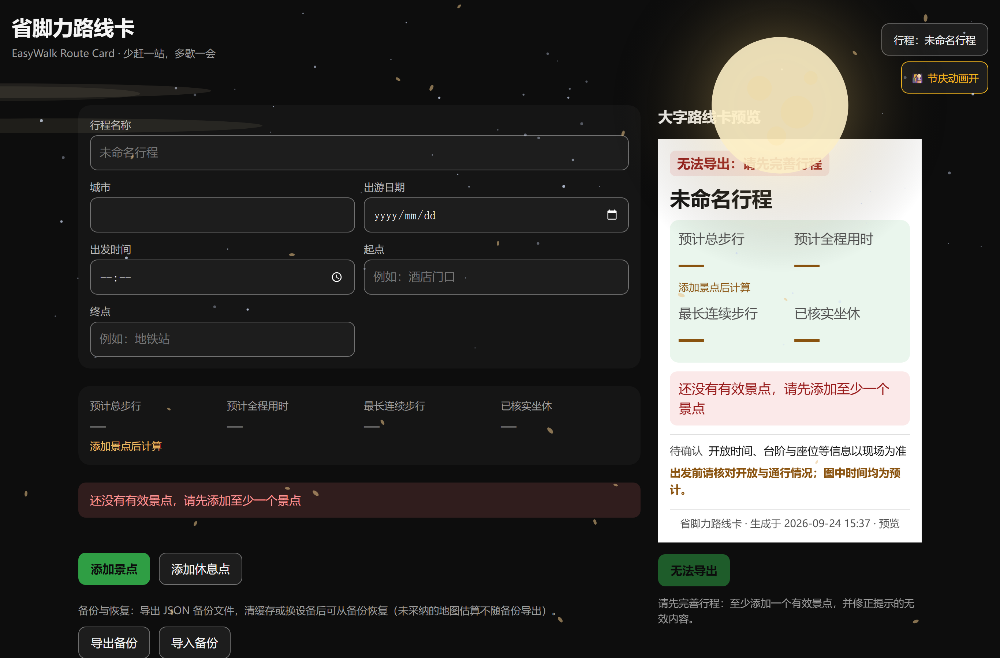

不喜欢就点顶栏的 **「节庆动画开」** 按钮关掉（再点一下又能开）。系统设置了"减少动态效果"时会自动安静下来。

---

## 八、名词解释（看数字前先看这里）

| 你看到的词 | 人话解释 |
| --- | --- |
| 必去 | 这站一定要去；跳过时软件会多问你一句 |
| 可选 · 累了可跳过 | 这站可去可不去 |
| 待确认 | 还没填 / 没查到，软件不瞎猜 |
| 已知约 X 分钟 | 有些数据还缺，X 是"至少这么多"，不是完整总数 |
| 草稿 | 行程还能用，但有信息没填全；卡片上会标出来提醒家人 |
| 完整 | 该填的都填了，导出按钮会变成"导出图片" |
| 已采纳地图估算 | 地图查的时间你确认保存了（是估算，非实地核实） |
| 直线距离，非步行路程 | "两点拉直线"的距离，只做参考，不参与任何计算 |
| 同一入口 | 两站其实是同一个门，不用走路，所以没有时间 |
| 歇脚绕行 | 为了坐下歇一会，比直走多走几分钟 |

---

## 九、常见问题（出事先看这里）

**问：我的行程存在哪里？会丢吗？**
答：存在你这台设备的浏览器里（localStorage），不上传服务器。所以：同一台电脑同一个浏览器打开都在；**清浏览器缓存、换电脑、换浏览器就没了**。重要行程请用"导出备份"或直接导出图片。

**问：为什么有的数字是"待确认"，有的是"已知约 X 分钟"？**
答：那是软件在老实告诉你"信息还缺"。比如休息点没填时长，它就不知道最长连续步行是多少，只会说"待确认"，绝不用假数字糊弄你。把缺的格子补上，数字就会变完整。

**问：点了"导出图片"没反应 / 浏览器不让下载？**
答：看浏览器地址栏右边有没有"已阻止下载"的小图标，点它选"始终允许"；或者一张一张点"保存第 N 张"。

**问：导出的图片字会糊吗？**
答：不会。导出按 3 倍清晰度生成，字大、边缘清楚，发微信群、打印都够用。内容多长就切几张，**绝不缩小字号、绝不裁掉内容**。

**问：显示"地图服务未配置"是软件坏了吗？**
答：没坏。只是没配地图 Key，搜索和自动规划用不了，手动填写、预览、导出照常。想开通看[第二章的"可选"小节](#可选开通地图查询功能不做也不影响主流程)。

**问：跳过一站之后，时间怎么变成"待补充"了？**
答：路线变了，旧的步行时间作废（不能乱套用）。在路段上点"编辑"重新填一次就行。

**问：能把行程给别人接着编辑吗？**
答：可以。"导出备份"得到的 .json 文件发给对方，他用"导入备份"就能接着改。图片则是给"看的人"用的。

**问：界面飘着月亮烟花，挡我视线了？**
答：点顶栏"节庆动画开"按钮关掉即可，只在 9 月 20 日～10 月 7 日自动开启。

**问：填错了数字、或者乱点了"清空"怎么办？**
答：弹窗都会再问你一次，看清楚再点"确认"。已经删掉的内容找不回来——所以**改大动作前先"导出备份"**，这是唯一的后悔药。

---

## 十、三句要紧的话

1. **数字拿不准就留空**，软件宁可写"待确认"也不猜。
2. **重要行程先备份**：点"导出备份"存好 .json 文件，再折腾。
3. **出门以现场为准**：开放时间、台阶、座位这些信息软件只帮你记和提醒，上路前再核对一遍。

祝一路走得省脚力、玩得开心。
